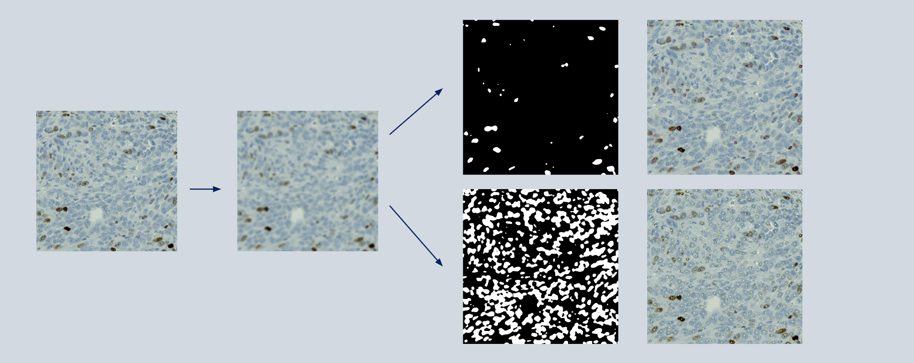
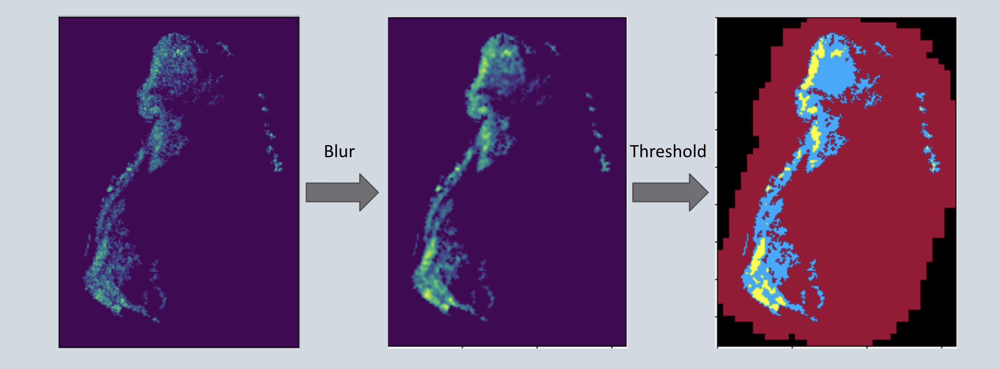
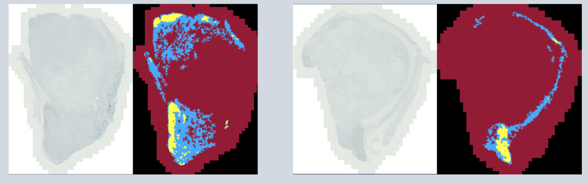

# KI67forWSI
Data pipeline for calculating cell counts over whole slide images with IHC staining

This pipeline was created to automate the calculation of the Ki67 index from stained mouse tissue whole slide images in the Zeiss CZI format.
The pipeline has two main sections, the first uses a convolutional net to classify 256x256 panels as either viable tissue or panels to discard. Once the regions of interest have been identified and cleaned, a watershed algorithm is then used to count positive and total cells from viable panels. These counts are output into an Excel sheet that can be analyzed using R or other tools. Additionally, the counts from individual panels are used to find dense regions of positive cells within the regions of interest.

This pipeline was used on images ranging from 5 to 15GB in the CZI format. When run on a CPU, the analysis took from 20 minutes up to 45 minutes for the largest images (manual analysis could take 6 to 10 hours for just marking all areas of viable tissue).

The most up-to-date version of the pipeline is /python_code/fulpipeV2.py

# AI tissue analysis

# Watershed Method

# Dense region detection
The map on the right depicts viable tissue shown in blue and the dense areas within those regions shown in yellow. Discarded areas of the image are colored red.

# Example of Results

