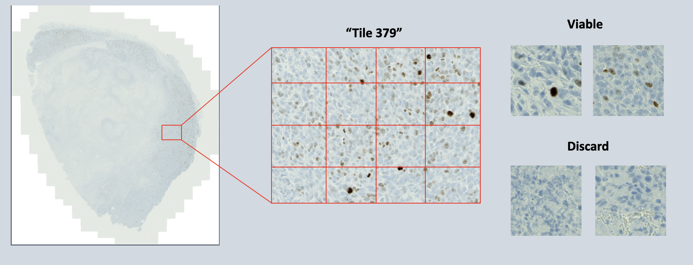

# KI67forWSI
Data pipeline for calculating cell counts over whole slide images with IHC staining

This pipeline was created to automate the calculation of the Ki67 index from stained mouse tissue whole slide images in the Zeiss CZI format.
The pipeline has two main sections, the first uses a convolutional net to classify 256x256 panels as either viable tissue or panels to discard. Once the regions of interest have been identified and cleaned, a watershed algorithm is then used to count positive and total cells from viable panels. These counts are output into an Excel sheet that can be analyzed using R or other tools. Additionally, the counts from individual panels are used to find dense regions of positive cells within the regions of interest.

This pipeline was used on images ranging from 5 to 15GB in the CZI format. When run on a CPU, the analysis took from 20 minutes up to 45 minutes for the largest images (manual analysis could take 6 to 10 hours for just marking all areas of viable tissue).

The most up-to-date version of the pipeline is /python_code/full_pipeV2.py

This code was used on CZI files which consist of "mosaic tiles" that were 1200px by 1600px. Each tile had corresponding coordinates for its place in the overall whole slide image. 

# AI tissue analysis
For AI classification each tile was split into 16 256x256 square panels. The AI was trained to classify panels with viable cells and protein staining as of interest for counting. Other panels such as necrotic tissue and background were discarded. The following two images show the classification task over the mosaic tiles and the resulting map of areas selected by the AI model.

The output of the model is shown in the second image. Using the ndi label function, clusters of panels are counted so that small clusters can be removed and gaps filled in to produce the cleaned map for viable regions on the right.

# Watershed Method
For cell counting, selected panels were filtered using a Gaussian blur and then thresholded for positive cells (showing brown staining), and all cells (brown and blue staining). The watershed algorithm uses local maxima of distance to the background, shown in black, as potential cell centers.

# Dense region detection
Once cell counts were calculated over the viable regions, the positive cell counts were used to calculate the cell density of each panel with a weighted average of the panel and its neighbors.
The map on the right depicts viable tissue shown in blue and the dense areas within those regions shown in yellow. Discarded areas of the image are colored red.

# Example of Results

